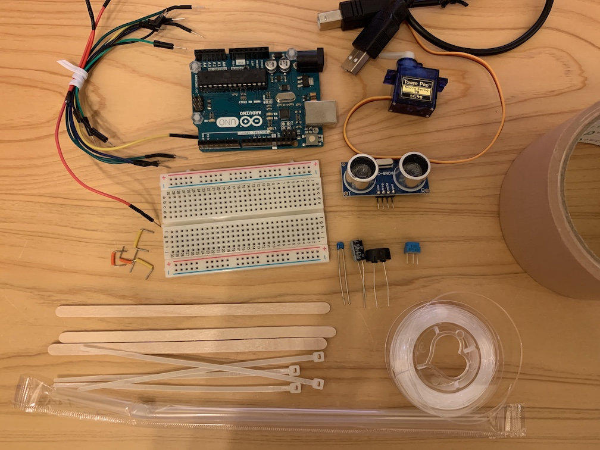
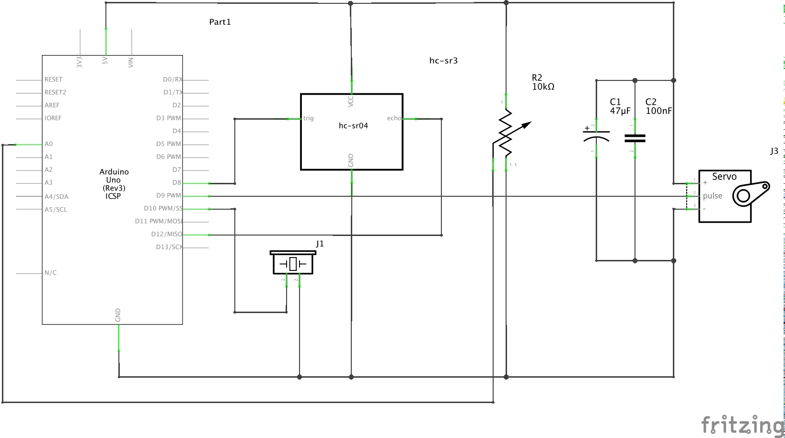
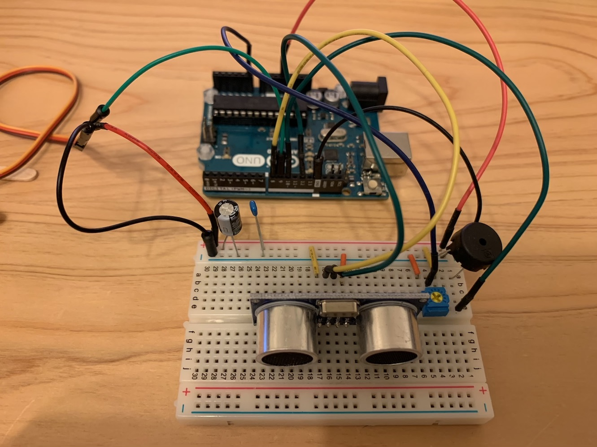
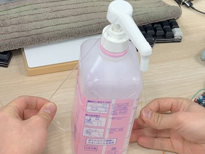
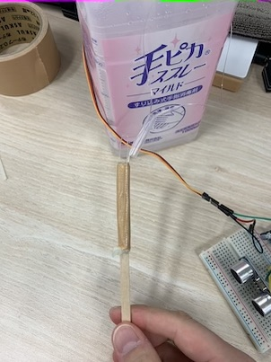

# Touchless Sanitizer

## これは何か

アルコール消毒液などのディスペンサポンプをタッチレスでプッシュしてくれるガジェットです．
超音波距離センサとサーボモータを使うことで，センサに手を近づけるだけで，自動でポンプをプッシュしてくれます．
できるだけ身近で手に入りやすい材料で作れるように考えました．

以下のメリットがあります．

* ポンプ部に触れずに清潔に利用できる
* 使用者に依らず一定量を噴霧できる

以下の機能があります．

* ポンプを押す強さの調整
* 手を近づけた時の検出音の再生

## 用意するもの

### 材料

| 品物                         | 型番・スペック | 個数   | 備考                     |
|------------------------------|----------------|-------:|--------------------------|
| 制御コンピュータ             | Arduino uno    | 1      |                          |
| サーボモータ                 | SG-90          | 1      |                          |
| 超音波距離センサ             | HC-SR04        | 1      |                          |
| 半固定ボリューム             | 10kΩ(103)     | 1      |                          |
| 圧電スピーカ                 | --             | 1      |                          |
| アルミ電解コンデンサ         | 47uF           | 1      |                          |
| 積層セラミックコンデンサ     | 0.1uF(104)     | 1      |                          |
| ブレッドボード               | 400穴          | 1      |                          |
| ジャンパワイヤ               | --             | 10数本 |                          |
| USBケーブル                  | --             | 1      |                          |
| ACアダプタ                   | --             | 1      | コンセントに接続する場合 |
| 木製コーヒーマドラ           | --             | 3      | 似たような棒であればOK   |
| 結束バンド                   | --             | 4      |                          |
| テグス（釣り糸・ナイロン糸） | 直径0.5mm      | 数10cm |                          |
| 布テープ                     | --             | 数10cm |                          |
| ストロー                     | --             | 数cm   |                          |

### 工具

* プラスドライバ（半固定ボリューム調整用）
* はさみ

## 作り方

### 回路の作成

次のような回路をブレッドボードに作成します．

実装は次の画像を参考にしてください．

### Arduinoプログラム

[Arduino IDE](https://www.arduino.cc/en/main/software)を使い，`arduino/touchless-sanitizer/touchless-sanitizer.ino`をコンパイルしArudinoへ書き込みます．

### ボトルへの固定

ポンプのプッシュに強い力がかかるので，しっかりと固定する必要があります．
この作業は，誤動作を防ぐため，Arduinoからサーボモータを取り外した状態で行ってください．

#### サーボモータの固定

まずは，サーボモータと2本のコーヒーマドラを結束バンドで固定します．

これを布テープでボトルへ貼り付けます．
この時，サーボモータが上側に振り切っていて，プロペラがその方向を向いていることを確認してください．
サーボモータが画像手前側を回って回転するように設置します．

#### ケーブルの接続

ポンプを引っ張るためのケーブルとして，テグスを用意します．
長さは，ボトルを跨ぐ長さ**x2**くらいです．（画像ではわかりにくいですが，ケーブルが2重になっているので注意してください．）

ケーブルをサーボモータのプロペラの穴に通します．

ストローを数cm切ってケーブルを通し，ポンプの上部に貼り付けます．

#### ケーブルの固定

サーボモータを取り付けたのと反対側の面にケーブルを固定していきます．

ケーブルで輪を作り，コーヒーマドラに結束バンドで固定します．
（コーヒーマドラをボトルの側面に固定することを考え，予めケーブルの長さを調整してください．）

輪を結び，ケーブルをコーヒーマドラの一方にまとめ，布テープでグルグル巻きにして固定します．

最後に，これを布テープでボトルへ貼り付けます．この時，ケーブルがピンと張るようにしてください．

これで完成です．

## 調整

半固定ボリュームを反時計回りいっぱいに回した状態でArduinoを電源につなぎます．
この状態では，超音波距離センサに手を近づけると，音が鳴りますが，サーボモータは動きません．
ここから，半固定ボリュームを時計回りに動かすほど，サーボモータの動く角度が大きくなるので，
試しながら，最適な分量が噴霧できるボリュームに調整してください．
