# Touchless Sanitizer

[日本語](README.ja.html)

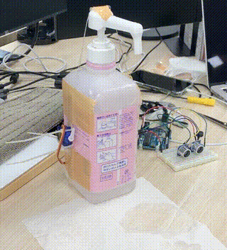

## About

This is a gadget which helps you to push pump of (sanitizer) dispenser without touch.
With using Ultra-sound distance sensor and servo motor, it pushes pump automatically by moving your hands close to the sensor.
You can build it with familiar materials.

It has advantages bellow.

* You don't have to touch any place, so it's clean
* Independent of user, Constant amount of sanitizer will be spraied

It has functions bellow.

* You can adjust force for pushing pump
* Object detection sound will be played

## Preparation

### Materials

| Item                            | Model/Spec        | Quantity       | Note              |
|---------------------------------|-------------------|---------------:|-------------------|
| Controller                      | Arduino uno       | 1              |                   |
| Servo motor                     | SG-90             | 1              |                   |
| Ultra-sound distance sensor     | HC-SR04           | 1              |                   |
| Trimmer resister                | 10k ohm(103)      | 1              |                   |
| Piezoelectric Speaker           | --                | 1              |                   |
| Aluminum electrolytic capacitor | 47uF              | 1              |                   |
| Multilayer ceramic capacitors   | 0.1uF(104)        | 1              |                   |
| Breadboard                      | 400 holes         | 1              |                   |
| Jumper wire                     | --                | 10 and several |                   |
| USB cable                       | --                | 1              |                   |
| AC charger                      | --                | 1              | if you use outlet |
| Wooden muddler                  | --                | 3              | or simular stick  |
| Zip ties                        | --                | 4              |                   |
| Fishing line                    | 0.5mm in diameter | dozens cm      |                   |
| Duct tape                       | --                | dozens cm      |                   |
| Straw                           | --                | a few cm       |                   |

### Tools

* Phillips screwdriver (for adjusting the trimmer resister)
* Scissors

## How to build

### Circuit

Implement circuit bellow to the breadboard.

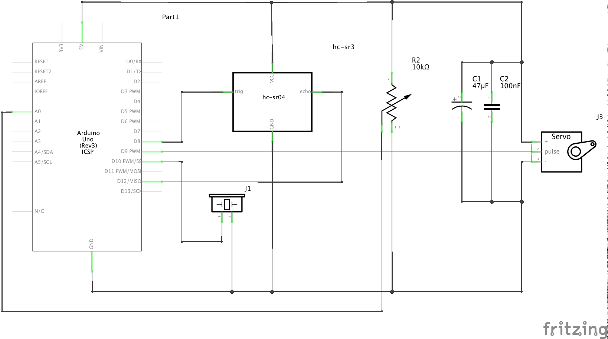

Refer to these images.

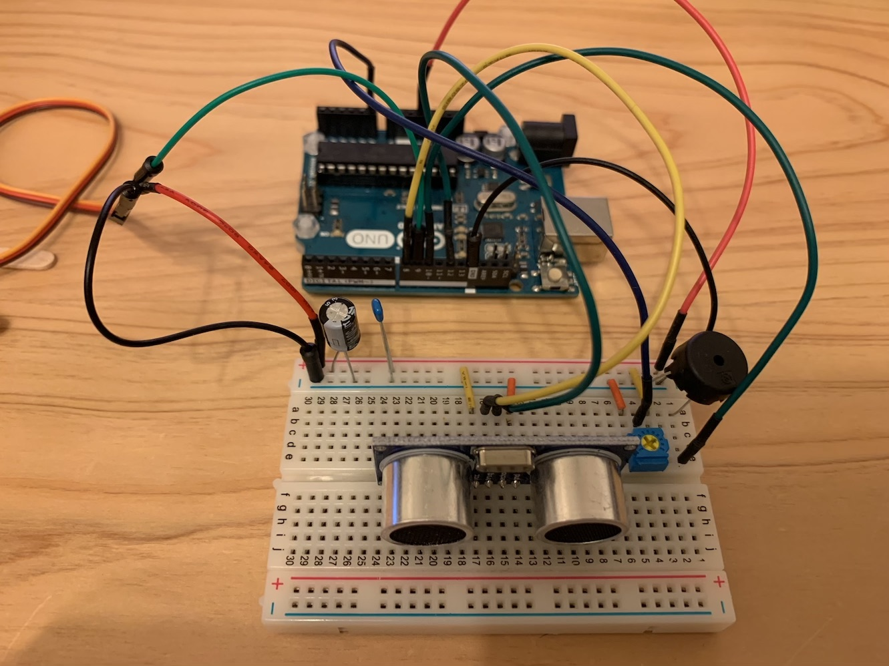
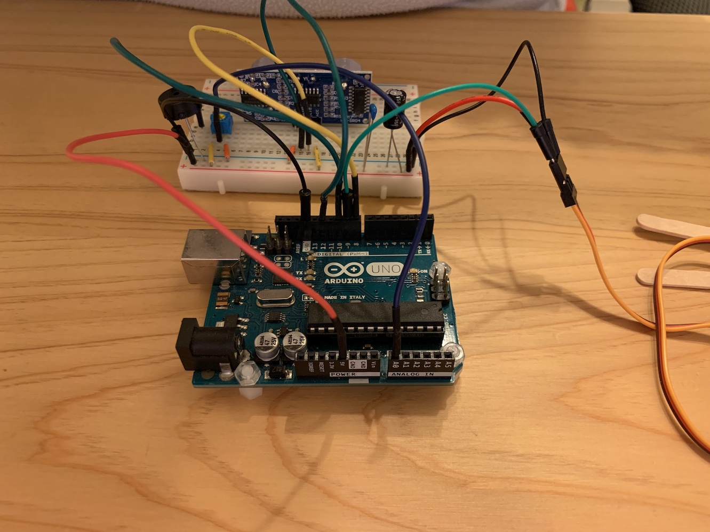
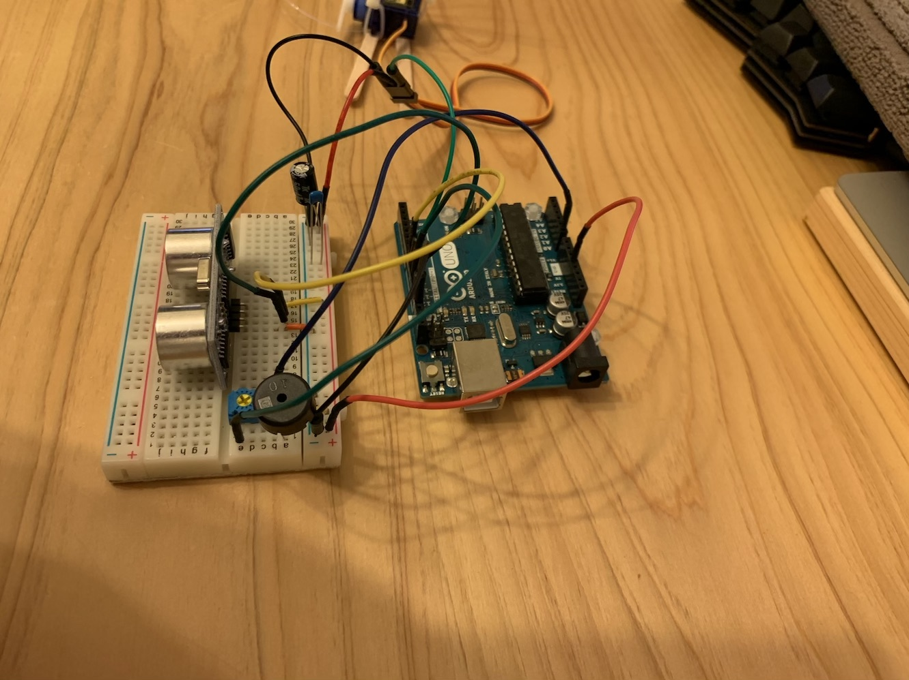
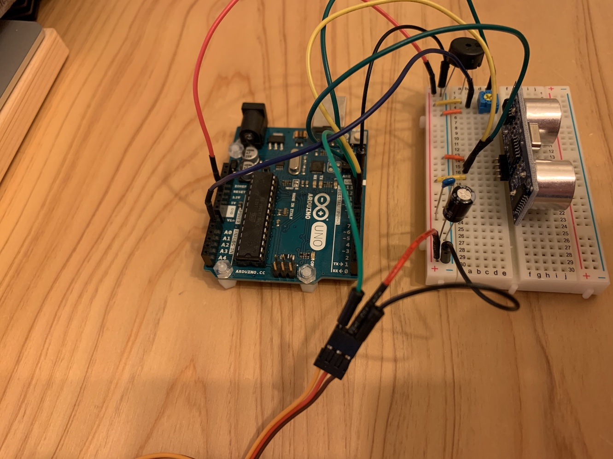

### Arduino Program

Compile `arduino/touchless-sanitizer/touchless-sanitizer.ino` and write it to the Arduino with [Arduino IDE](https://www.arduino.cc/en/main/software).

### Fixing to the Bottle

Fix the gadget to the bottle tightly, because high tension will be applied.
Before these steps, you would remove the servo motor from the Arduino to prevent unexpected movement.

#### Fixing the servo motor

Attach 2 muddlers to the servo motor by zip ties.

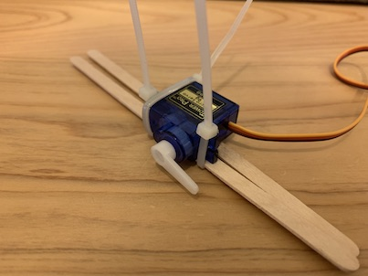

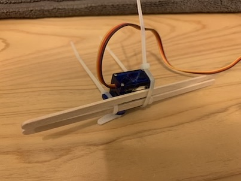

Tape that to the bottle.
At this time, check if the propeller is directed to up side.
The servo motor will rotate along forward.

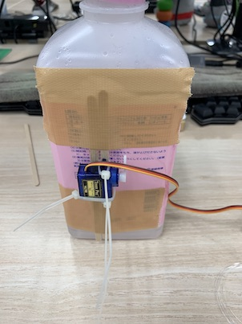

#### Connecting the cable

Using fishing line as cable which pulls pump.
Cut out fishing line about **twice as** the length straddling the bottle.
(Be aware the fishing line in the image is double layered.)

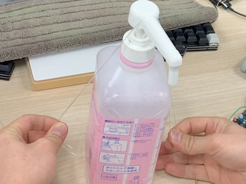

Thread the cable through the hole of propeller.

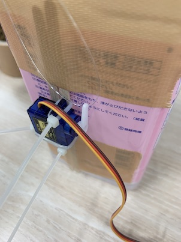

Cut out straw a few cm, thread the cable through it and tape it at the top of the bottle.

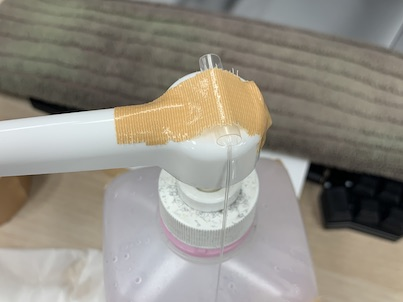

#### Fixing the cable

Fix the cable to opposite side of servo motor as follow.

Make loop with the cable and fix it to a muddler.
(Considering the length of the cable to fix the muddler to the side of bottle. )

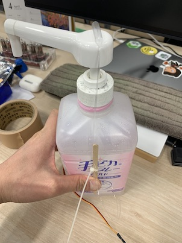

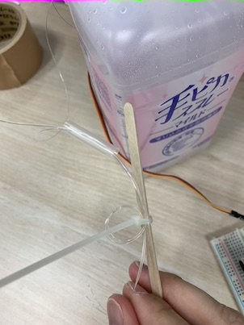

Tie up the loop, put it to one side and tape it to the muddler.

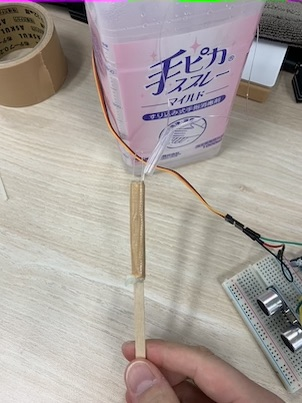

At last, tape the muddler to the bottle with making sure the cable is tight.

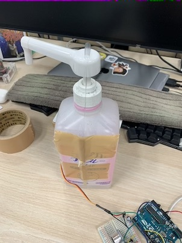

It's now complete.

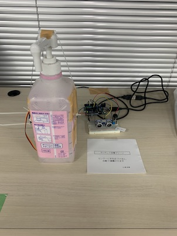

## Adjustment

Power on the Arduino after setting the trimmer resister minimum (fully counterclockwise).
At this time, detection sound will be played but the servo motor will not move, when you take your hand close to the sensor.
From here, volume up trimmer resister little by little.
